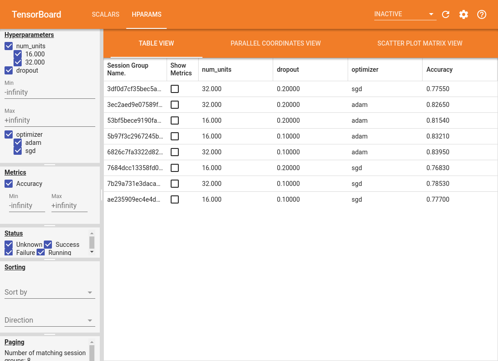

# Markdown 연습 및 개발용
## Skopt와 Tensorboard를 결합
> skopt 라이브러리를 사용하여 최적의 모델을 찾는 동시에 모델이 가진 특성을 Tensorboard로 확인한다.

 

## 1\. tensorflow v2가 되면서 tensorboard도 다양한 기능이 생겼다.
### - tensorboard에 hyperparameter를 저장하고 확인할 수 있는 기능이 있다.  
[Hyperparameter Tunning with the HParams Dashboard](https://www.tensorflow.org/tensorboard/hyperparameter_tuning_with_hparams)

위와 같은 대쉬보드를 통해서 Hyperparameter와 결과를 확인할 수 있다.

 

## 2\. Skopt의 Hyperparameter tunning 기능

