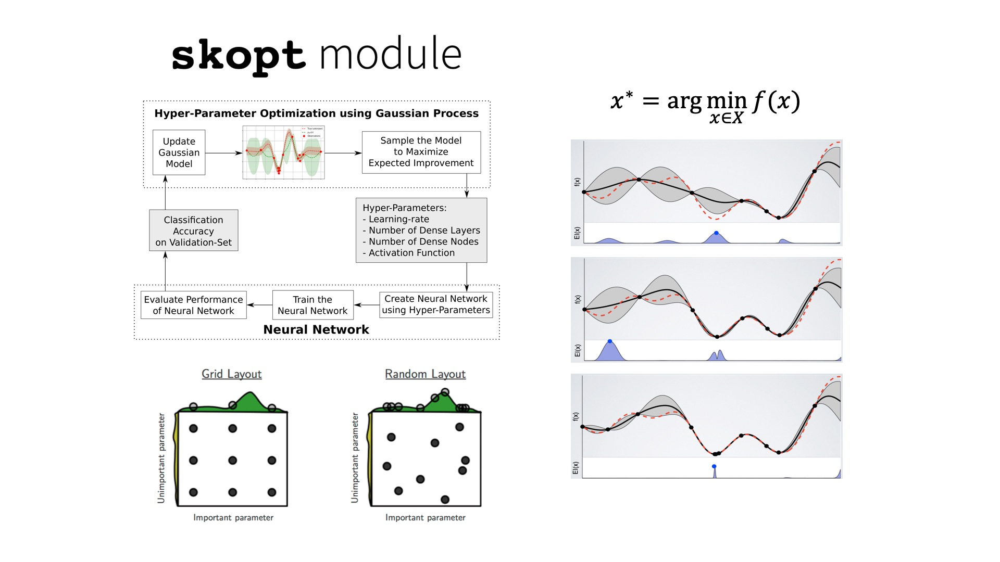
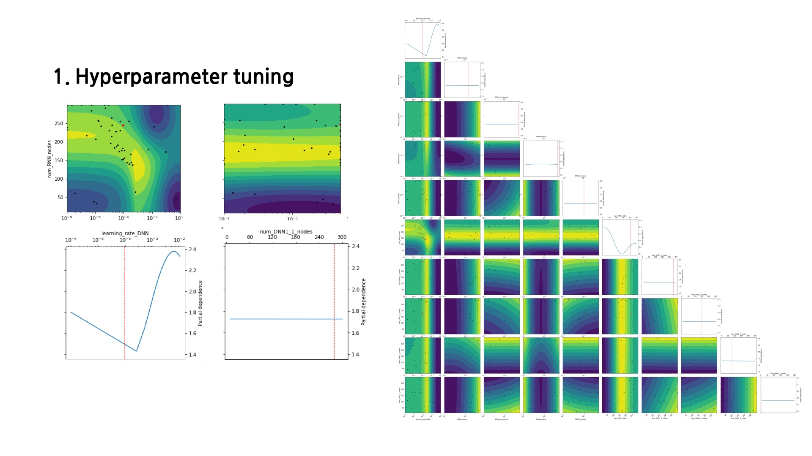
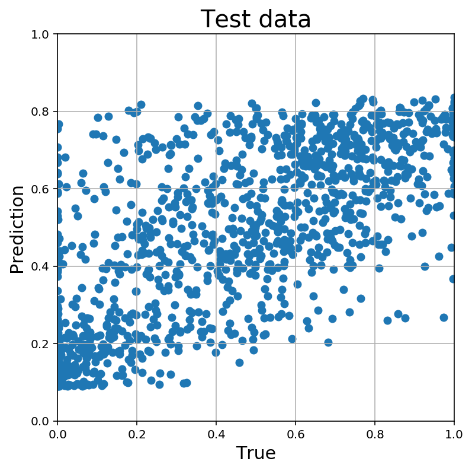
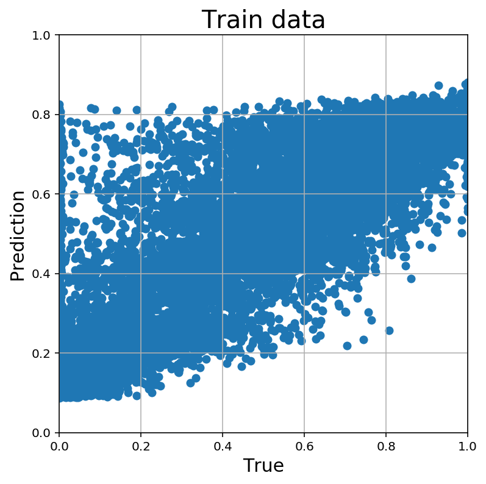
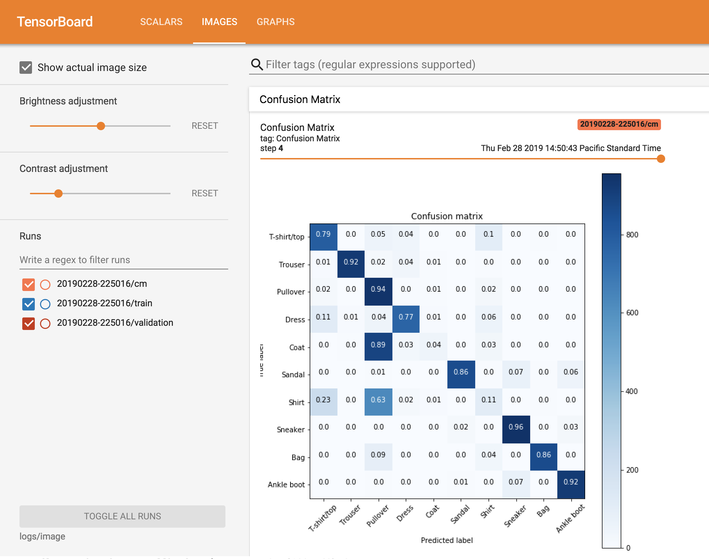

# Markdown 연습 및 개발용
## Skopt와 Tensorboard를 결합
> skopt 라이브러리를 사용하여 최적의 모델을 찾는 동시에 모델이 가진 특성을 Tensorboard로 확인한다.

 

## 1\. tensorflow v2가 되면서 tensorboard도 다양한 기능이 생겼다.
### - tensorboard에 hyperparameter를 저장하고 확인할 수 있는 기능이 있다.  
[Hyperparameter Tunning with the HParams Dashboard](https://www.tensorflow.org/tensorboard/hyperparameter_tuning_with_hparams)

위와 같은 대쉬보드를 통해서 Hyperparameter와 결과를 확인할 수 있다.

 

## 2\. Skopt의 Hyperparameter tunning 기능
[Skopt website](https://scikit-optimize.github.io)  
  
Skopt는 Bayesian optimization을 활용하여 최적의 hyperparameter를 찾게 도와준다.  

위와 같이 각 hyperparameter별로 모델을 학습하여 최적의 값을 추정해 나간다.

 
====

## **현재 최적 모델을 찾아 가는데 문제점**

1. mse 최소 값이라도 그래프 형태가 좋지 않을 수 있다.  
    

     
    

    그래프의 위 아래가 잘린 형태를 보여주고 있다.  
    Early stop을 통해서 Correlation은 가장 좋은 수치를 보여주고 있지만 실제로 그래프는 썩 만족스럽지 않은 경향을 보이고 있다.

 

2. skopt를 사용하면 최종 결과만 알 수 있지 각 모델의 특성을 알 수 없다.  
    skopt를 학습하면 그래프를 통해 최적값을 확인할 수 있다.  
    하지만 그 결과인 mse만 알 수 있어서 그 모델 다른 수치를 알 수 없다.  
    그리고 결과를 text로 저장해야해서 깔끔하게 볼 수 없다.  
    > tensorboard에서 hyperparameter를 기록해주고 그 결과도 저장해서 볼 수 있게 바뀌었다.  
    > 그리고 다른 그래프도 그래서 저장해주면 같이 출력해 준다.  
    > 여기에 우리가 필요한 그래프를 그려서 출력해주면 모델의 완성도를 확인할 수 있다.
    >

3. 최적화 과정을 보고 싶고 그 결과를 잘 정리하고 싶다.  
    > tensorboard를 활용하면 학습 과정을 상세히 알 수 있다.